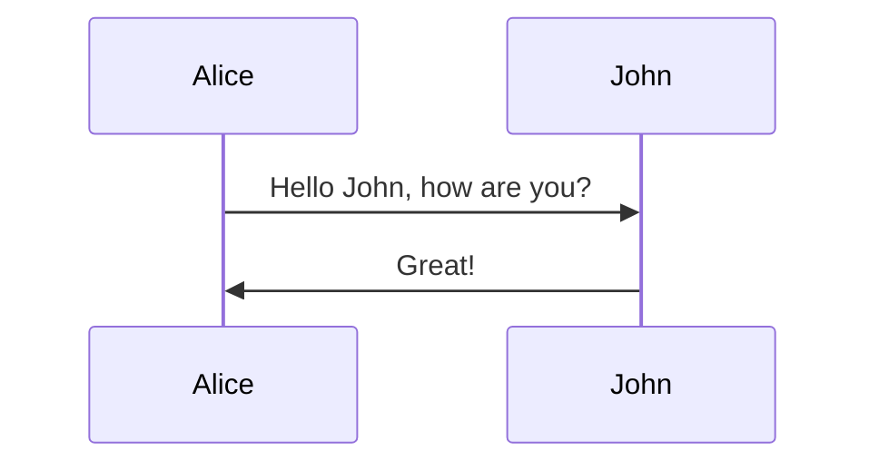
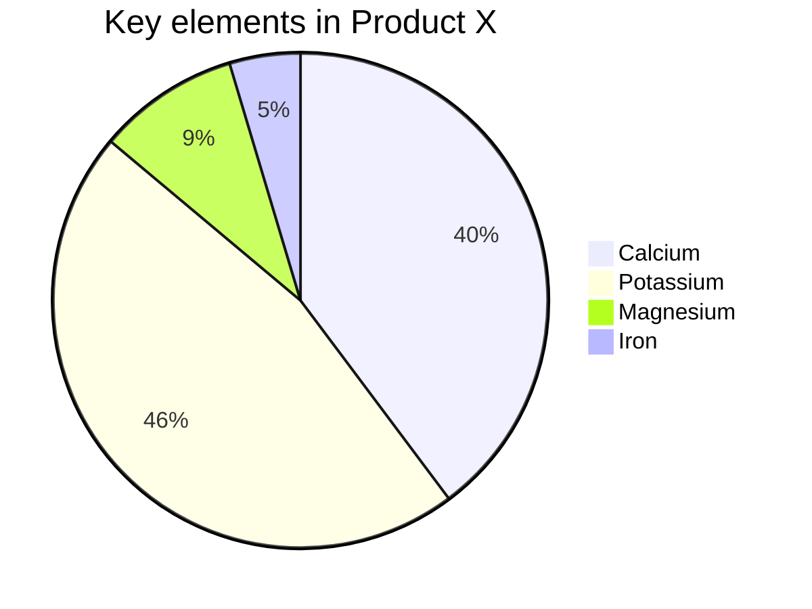
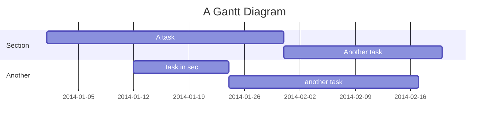
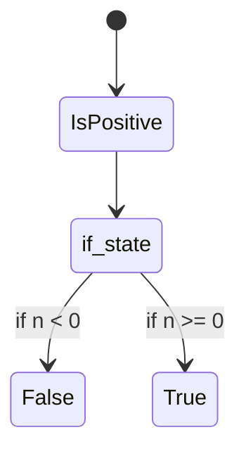

    curl http://commondatastorage.googleapis.com/git-repo-downloads/repo > ~/bin/repo
    chmod a+x ~/bin/repo

    # 把 repo指令加入到环境当中
    mkdir ~/bin
    export PATH=~/bin:$PATH

```math
\ce{SO4^2- + Ba^2+ -> BaSO4 v}
```

```math
E = mc^2
```







| Col1      | Col2 | Col3              | Col4                  |
| --------- | ---- | ----------------- | --------------------- |
| aaaaaaaaa |      | ddddddddddddddddd |                       |
|           |      |                   |                       |
|           |      |                   | ccccccccccccccccccccc |
|           |      |                   |                       |

aa`aaa`aacd

[sddddd](https://github.com/fyoomm/rdk-network-wifi)

*   [ ] \- \[x]
*

1.
2.

*

***

## ccccc

# ffggg

#### vvvvv

hg==f==f

==bbbv==

~~ccccc~~

++hgff++

*jvf*

**vdd**




